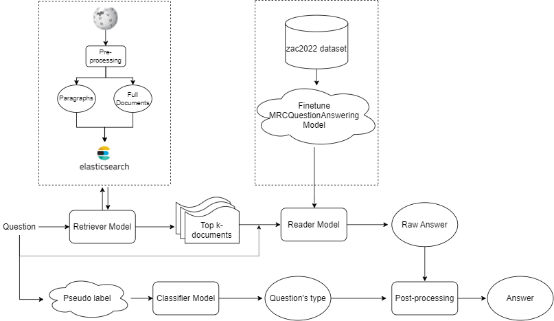

### Table of contents
- [ Introduction](#-introduction)
- [ Pipeline](#-pipeline)
- [ Approach](#-approach)
  - [Step 1: Create index elasticsearch](#step-1-create-index-elasticsearch)
  - [Step 2: Get top k-articles ralated:](#step-2-get-top-k-articles-ralated)
  - [Step 3: Get raw answer](#step-3-get-raw-answer)
  - [Step 4: Post-process](#step-4-post-process)
- [ Usage](#-usage)
  - [ Pre-processing](#-pre-processing)
  - [ Get answers](#-get-answers)


# <a name="introduction"></a> Introduction

Due to the high quality of the MRC model, we only focus on the retrieval model which looking for the most relevant documents with the given question.

# <a name="pipeline"></a> Pipeline
<p align="center">
  
</p>

# <a name="approach"></a> Approach
## Step 1: Create index elasticsearch
Wikidump will be pushed to elasticsearch, each document is a wikipage.

## Step 2: Get top k-articles ralated:
Tokenize the input query using VncoreNLP.

**Rules**:
- If the query input has proper noun such as Vua Nguyễn Huệ, Hà Nội, etc , we will query elasticsearch by these tokens and the document must has at least one of them.
- If the query input has not proper noun, we will search elasticsearch by these tokens and full query input.

And finally, top k-documents will be re-ranking by intersection-based score.

## Step 3: Get raw answer
Using MRC model to extract answer from top k-articles.

## Step 4: Post-process
Each question belongs to one of three categories : The question about wikipage, the question about date time, the question about number.
Based on its category to format answer.

# <a name="usage"></a> Usage
## <a name="preprocessing"></a> Pre-processing
Create index elastic and pushing wikidump to elasicsearch by running command

```bash
python create_documents.py --host=localhost --port=9200 --index=wikipedia --num_pool=10 --data_path=<YOUR_WIKIDUMP_DATA_PATH>
```

Create index elastic and pushing sub document for post-processing to elasicsearch by running command

```bash
python create_documents.py --host=localhost --port=9200 --index=paragraph --num_pool=10 --data_path=<YOUR_WIKIDUMP_DATA_PATH>
```

## <a name="get-answers"></a> Get answers
Noticed that you have created [ qtype_model](/train/qtype_classifier) (Follow [ this instructions](/train/qtype_classifier/README.md) for more information)
Finally, just run this command to get the answer for your question:
```bash
python main.py --es_host=localhost --es_port=9200 --es_index=wikipedia --es_title_index=paragraph  --es_document_index=wikipedia --classifier_model=<YOUR_CLASSIFY_MODEL_PATH>
```
